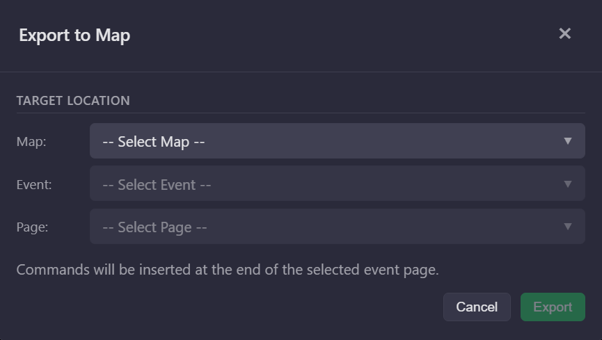
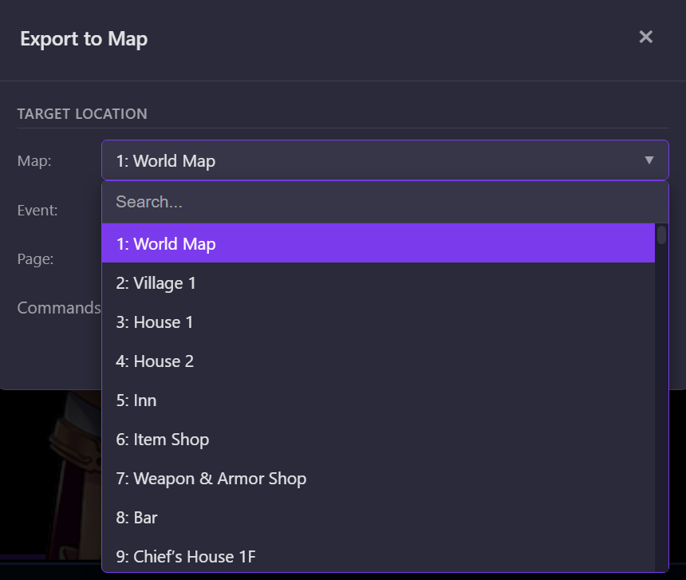

# Timeline Scene Builder

A visual timeline editor for creating cutscenes and picture sequences for RPG Maker MZ. Arrange pictures, effects, and text on a frame-based timeline, then export directly to RPG Maker event commands.


[](./LICENSE.txt)

## Features

- **Timeline Editor** - Visual timeline with lanes for Pictures, Effects, and Text
- **Timeline Minimap** - Overview bar showing all events with click-to-navigate
- **Visual Preview** - Live 16:9 preview with drag-and-drop positioning
- **Grid Overlay & Snap** - 64px grid for precise positioning
- **Playback System** - Play through your scene with automatic text pausing
- **8 Event Types** - Show/Move/Rotate/Tint/Erase Picture, Show Text, Wait, Screen Flash
- **Image Browser** - Lazy-loading thumbnails with multi-select and search
- **Export Options** - Copy JSON to clipboard or export directly to map files
- **Undo/Redo** - Full history support (50 entries)
- **Auto-save** - Automatic backup every 3 minutes
- **Drag & Drop** - Drop .mzscene files to open them

## Installation

```bash
cd tools/mz-scene-builder

# Install dependencies (use --no-bin-links on WSL)
npm install --no-bin-links

# Run the application
npm start
```

## Usage

1. Click **Open Project** and select your RPG Maker MZ project folder
2. Browse the Pictures folder on the left panel
3. Double-click an image to add it as a Show Picture event
4. Use the timeline to arrange events across frames
5. Edit properties in the right panel
6. Use **Export to Map** to write directly to a map file

### Exporting





Select a target Map, Event, and Page — commands are inserted at the end of the selected event page.

## Event Types

| Type | RPG Maker Code | Description |
|------|----------------|-------------|
| Show Picture | 231 | Display an image with position, scale, opacity, blend mode |
| Move Picture | 232 | Animate position, scale, opacity over duration with easing |
| Rotate Picture | 233 | Set continuous rotation speed |
| Tint Picture | 234 | Color adjustment with presets (Sunset, Night, Sepia, etc.) |
| Erase Picture | 235 | Remove a picture from screen |
| Show Text | 101/401 | Display text with background and position options |
| Wait | 230 | Pause for a number of frames |
| Screen Flash | 224 | Flash the screen with color and intensity |

## Keyboard Shortcuts

| Shortcut | Action |
|----------|--------|
| Ctrl+Z | Undo |
| Ctrl+Shift+Z / Ctrl+Y | Redo |
| Ctrl+S | Save scene |
| Ctrl+P | Insert picture at playhead |
| Ctrl+T | Insert text at playhead |
| Ctrl+C | Copy selected event |
| Ctrl+V | Paste event at current frame |
| Ctrl+D | Duplicate selected event |
| Delete | Delete selected event |
| Arrow Keys | Move selected image by 1px |
| Shift+Arrow Keys | Move selected image by 10px |
| F1 | Show keyboard shortcuts help |

## Tech Stack

- **Runtime**: Electron 40
- **Language**: Vanilla JavaScript (CommonJS)
- **Architecture**: Event bus with centralized state
- **Testing**: Jest (59 tests, 100% coverage on critical functions)
- **Build**: electron-builder (NSIS + portable)

## Project Structure

```
src/
├── lib/
│   └── mz-converter.js    # MZ format conversion + path security
├── modules/
│   ├── state.js            # Central state store
│   ├── event-bus.js        # Pub/sub module communication
│   ├── init.js             # Bootstrap and event binding
│   ├── events.js           # Event creation/manipulation
│   ├── export.js           # RPG Maker JSON export
│   ├── file-ops.js         # Save/load .mzscene files
│   ├── playback.js         # Timeline playback
│   ├── undo-redo.js        # History stack
│   ├── keyboard.js         # Keyboard shortcuts
│   ├── timeline/           # Timeline rendering, minimap, drag
│   ├── preview/            # Canvas preview, image browser
│   └── properties/         # Property panels per event type
├── index.html
├── styles.css
└── renderer.js
```

## Development

```bash
# Run with DevTools
npm run dev

# Run tests
npm test

# Run tests in watch mode
npm run test:watch

# Run tests with coverage
npm run test:coverage

# Build for Windows
npm run build:win

# Build for macOS
npm run build:mac
```

## License

Copyright (c) 2026 W1nterstale. All rights reserved.
See [LICENSE.txt](LICENSE.txt) for terms of use.

---

*"RPG Maker" is a trademark of Gotcha Gotcha Games Inc. This project is not affiliated with or endorsed by Gotcha Gotcha Games.*
