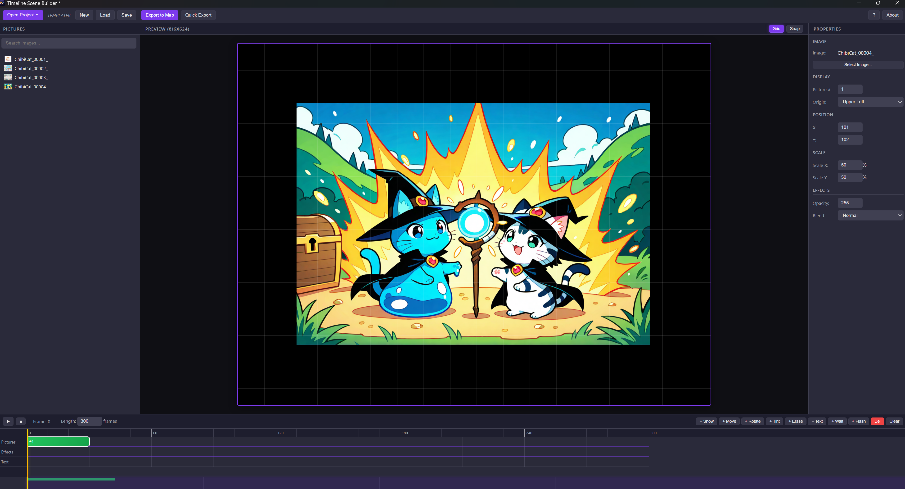

# Timeline Scene Builder

A visual timeline editor for creating cutscenes and picture sequences for RPG Maker MZ. Arrange pictures, effects, and text on a frame-based timeline, then export directly to RPG Maker event commands.


[](./LICENSE.txt)

> **Part of [MZ DevKit](https://github.com/topics/mz-devkit)** — a suite of visual tools for RPG Maker MZ:
> [`mz-plugin-studio`](https://github.com/Wintersta7e/mz-plugin-studio) (plugins) ·
> [`mz-interaction-builder`](https://github.com/Wintersta7e/mz-interaction-builder) (dialogue trees) ·
> [`mz-scene-builder`](https://github.com/Wintersta7e/mz-scene-builder) (timelines / cutscenes)

<p align="center">
  
</p>

## Features

- **Timeline Editor** - 4 visual lanes for Pictures, Effects, Text, and Timing; overlapping events stack into sub-rows automatically
- **Timeline Minimap** - Overview bar showing all events with click-to-navigate
- **Visual Preview** - Live 16:9 preview with drag-and-drop positioning
- **Grid Overlay & Snap** - 64px grid for precise positioning
- **Playback System** - Play through your scene with automatic text pausing
- **8 Event Types** - Show/Move/Rotate/Tint/Erase Picture, Show Text, Wait, Screen Flash
- **Image Browser** - Lazy-loading thumbnails with multi-select, search, and folder chips
- **Workspace Modes** - Toggle Design / Preview / Inspect layouts; Spacebar plays / pauses
- **Export Options** - Copy JSON to clipboard or export directly to map files
- **Undo/Redo** - Full history support (50 entries)
- **Auto-save** - Automatic backup every 3 minutes
- **Drag & Drop** - Drop .mzscene files to open them
- **Diagnostics** - F12 toggles DevTools; persistent log file at `%APPDATA%/Timeline Scene Builder/logs/main.log`

## Installation

```bash
cd tools/mz-scene-builder

# Install dependencies (use --no-bin-links on WSL)
npm install --no-bin-links

# Run the application
npm start
```

## Usage

1. Click **Open Project** and select your RPG Maker MZ project folder
2. Browse the Pictures folder on the left panel
3. Double-click an image to add it as a Show Picture event
4. Use the timeline to arrange events across frames
5. Edit properties in the right panel
6. Use **Export to Map** to write directly to a map file

### Preview

Drag and drop images directly on the 16:9 preview canvas. The grid overlay snaps to 64px increments.

### Timeline

Events are organised into four colour-coded lanes — Pictures, Effects, Text, and Timing. Events that overlap in time are stacked into separate sub-rows so simultaneously-visible pictures (or simultaneous tints, texts, etc.) never visually collide. A minimap below the lanes provides click-to-navigate across the full scene.

### Properties

Select any event to edit its properties in the right panel.

### Exporting

Select a target Map, Event, and Page — commands are inserted at the end of the selected event page.

## Event Types

| Type           | RPG Maker Code | Description                                                |
| -------------- | -------------- | ---------------------------------------------------------- |
| Show Picture   | 231            | Display an image with position, scale, opacity, blend mode |
| Move Picture   | 232            | Animate position, scale, opacity over duration with easing |
| Rotate Picture | 233            | Set continuous rotation speed                              |
| Tint Picture   | 234            | Color adjustment with presets (Sunset, Night, Sepia, etc.) |
| Erase Picture  | 235            | Remove a picture from screen                               |
| Show Text      | 101/401        | Display text with background and position options          |
| Wait           | 230            | Pause for a number of frames                               |
| Screen Flash   | 224            | Flash the screen with color and intensity                  |

## Keyboard Shortcuts

| Shortcut              | Action                       |
| --------------------- | ---------------------------- |
| Ctrl+Z                | Undo                         |
| Ctrl+Shift+Z / Ctrl+Y | Redo                         |
| Ctrl+S                | Save scene                   |
| Ctrl+P                | Insert picture at playhead   |
| Ctrl+T                | Insert text at playhead      |
| Ctrl+C                | Copy selected event          |
| Ctrl+V                | Paste event at current frame |
| Ctrl+D                | Duplicate selected event     |
| Delete                | Delete selected event        |
| Arrow Keys            | Move selected image by 1px   |
| Shift+Arrow Keys      | Move selected image by 10px  |
| F1                    | Show keyboard shortcuts help |

## Tech Stack

- **Runtime**: Electron 41
- **Language**: Vanilla JavaScript (ES Modules in renderer, CJS in main/preload)
- **Architecture**: Event bus with centralized state, contextIsolation + sandbox + CSP
- **Testing**: Jest (174 tests, per-file coverage thresholds)
- **Linting**: ESLint (strict rules) + Prettier, enforced via husky pre-commit hooks
- **Build**: electron-builder (NSIS + portable)

## Project Structure

```
src/
├── lib/
│   └── mz-converter.js    # MZ format conversion + path security
├── modules/
│   ├── state.js            # Central state store
│   ├── event-bus.js        # Pub/sub module communication
│   ├── init.js             # Bootstrap and event binding
│   ├── events.js           # Event creation/manipulation
│   ├── export.js           # RPG Maker JSON export
│   ├── file-ops.js         # Save/load .mzscene files
│   ├── playback.js         # Timeline playback
│   ├── undo-redo.js        # History stack
│   ├── keyboard.js         # Keyboard shortcuts
│   ├── timeline/           # Timeline rendering, minimap, drag
│   ├── preview/            # Canvas preview, image browser
│   └── properties/         # Property panels per event type
├── index.html
├── styles.css
└── renderer.js
```

## Development

```bash
# Run with DevTools
npm run dev

# Lint and format
npm run lint          # ESLint check
npm run lint:fix      # ESLint auto-fix
npm run format        # Prettier write
npm run format:check  # Prettier check

# Run tests
npm test              # 174 tests
npm run test:watch    # Watch mode
npm run test:coverage # Coverage report

# Build for Windows / macOS
npm run build:win
npm run build:mac
```

Pre-commit hooks (husky + lint-staged) automatically run ESLint and Prettier on staged files.

### Debug log

Both the main and renderer processes write to a single rotating log file:

- **Windows**: `%APPDATA%\Timeline Scene Builder\logs\main.log`
- **macOS**: `~/Library/Logs/Timeline Scene Builder/main.log`
- **Linux**: `~/.config/Timeline Scene Builder/logs/main.log`

The previous session is preserved as `main.log.1`. The default level in production is `INFO`, which captures lifecycle and IPC events as well as `[WARN] slow:` lines for any frame-budget overrun and `[WARN] longtask:` lines for any main-thread block ≥ 50 ms. **F12** or **Ctrl+Shift+I** opens DevTools at any time for live inspection.

## License

MIT License. See [LICENSE.txt](LICENSE.txt) for details.

---

_"RPG Maker" is a trademark of Gotcha Gotcha Games Inc. This project is not affiliated with or endorsed by Gotcha Gotcha Games._
